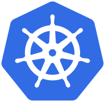
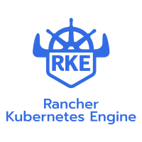

In this series of articles we will install a local Kubernetes cluster for experimentation.

There are certainly solutions like [Minikube](https://kubernetes.io/docs/setup/minikube/) or [Minishift](https://www.okd.io/minishift/) that already allow to easily install Kubernetes on a local workstation but none to my knowledge proposes to install a cluster with several nodes as we will do.

At first we will perform an installation of Kubernetes using the command line, without more automation than that. For that, we will use the Docker Machine tool, the Linux RancherOS distribution and finally the Rancher Kubernetes Engine (RKE) tool.

In a second step we will see how to automate this installation using the Terraform tool, with the aim of creating, modifying and destroying the Kubernetes cluster as simply as possible following the Infrastructure As Code approach.

## Prerequisites

In order to proceed with the installation of our Kubernetes cluster, the following prerequisites are required:

* a Linux client machine with 16 GB of memory (do not expect anything below 8 GB)
* the [VirtualBox](https://www.virtualbox.org/) virtualization solution installed and functional on the Linux computer (I will not go into the details, you will find everything you need on the official website)
* basic knowledge of Docker containers and Kubernetes orchestrator

The softwares used later are multi-platform, so an installation on another type of OS (Mac OS, Windows) or on another hypervisor (KVM, VMware Fusion) should be possible by adapting the procedure.

## Kubernetes



The only Kubernetes element required on the client machine is the Kubectl command line tool.

For its installation, I suggest you go through this method of the official documentation: https://kubernetes.io/docs/tasks/tools/install-kubectl/#install-kubectl-binary-using-curl

{}
**Warning**: be sure to select version 1.11.1 so that you do not have a bad surprise in the remainder of this article.
{}

Once installed, you can launch it to check that it works and to see the various commands it offers:

```shell
$ kubectl
kubectl controls the Kubernetes cluster manager.

Find more information at: https://kubernetes.io/docs/reference/kubectl/overview/

Basic Commands (Beginner):
  create         Create a resource from a file or from stdin.
  expose         Take a replication controller, service, deployment or pod and expose it as a new Kubernetes Service
  run            Run a particular image on the cluster
  set            Set specific features on objects

Basic Commands (Intermediate):
  explain        Documentation of resources
  get            Display one or many resources
  edit           Edit a resource on the server
  delete         Delete resources by filenames, stdin, resources and names, or by resources and label selector

Deploy Commands:
  rollout        Manage the rollout of a resource
  scale          Set a new size for a Deployment, ReplicaSet, Replication Controller, or Job
  autoscale      Auto-scale a Deployment, ReplicaSet, or ReplicationController

Cluster Management Commands:
  certificate    Modify certificate resources.
  cluster-info   Display cluster info
  top            Display Resource (CPU/Memory/Storage) usage.
  cordon         Mark node as unschedulable
  uncordon       Mark node as schedulable
  drain          Drain node in preparation for maintenance
  taint          Update the taints on one or more nodes

Troubleshooting and Debugging Commands:
  describe       Show details of a specific resource or group of resources
  logs           Print the logs for a container in a pod
  attach         Attach to a running container
  exec           Execute a command in a container
  port-forward   Forward one or more local ports to a pod
  proxy          Run a proxy to the Kubernetes API server
  cp             Copy files and directories to and from containers.
  auth           Inspect authorization

Advanced Commands:
  apply          Apply a configuration to a resource by filename or stdin
  patch          Update field(s) of a resource using strategic merge patch
  replace        Replace a resource by filename or stdin
  wait           Experimental: Wait for one condition on one or many resources
  convert        Convert config files between different API versions

Settings Commands:
  label          Update the labels on a resource
  annotate       Update the annotations on a resource
  completion     Output shell completion code for the specified shell (bash or zsh)

Other Commands:
  alpha          Commands for features in alpha
  api-resources  Print the supported API resources on the server
  api-versions   Print the supported API versions on the server, in the form of "group/version"
  config         Modify kubeconfig files
  plugin         Runs a command-line plugin
  version        Print the client and server version information

Usage:
  kubectl [flags] [options]

Use "kubectl <command> --help" for more information about a given command.
Use "kubectl options" for a list of global command-line options (applies to all commands).
```

## Docker Machine


[Docker Machine](https://docs.docker.com/machine/) is a tool that will allow us to easily create the virtual machines that will be used to host Kubernetes and equip them with the Docker Engine.

It is compatible with a large number of cloud or private virtualization vendors: Amazon Web Services, Google Compute Engine, Microsoft Azure, VMware vSphere and of course VirtualBox.

For its installation, I refer you to the official documentation:  https://docs.docker.com/machine/install-machine/

{}
**Warning**: be sure to select version 0.15.0 so that you will not have a bad surprise in the remainder of this article.
{}

As for Kubectl, you can check its operation by launching it without any special option:

```shell
$ docker-machine
Usage: docker-machine [OPTIONS] COMMAND [arg...]

Create and manage machines running Docker.

Version: 0.15.0, build b48dc28d

Author:
  Docker Machine Contributors - <https://github.com/docker/machine>

Options:
  --debug, -D                                           Enable debug mode
  --storage-path, -s "/home/sebastien/.docker/machine"  Configures storage path [$MACHINE_STORAGE_PATH]
  --tls-ca-cert                                         CA to verify remotes against [$MACHINE_TLS_CA_CERT]
  --tls-ca-key                                          Private key to generate certificates [$MACHINE_TLS_CA_KEY]
  --tls-client-cert                                     Client cert to use for TLS [$MACHINE_TLS_CLIENT_CERT]
  --tls-client-key                                      Private key used in client TLS auth [$MACHINE_TLS_CLIENT_KEY]
  --github-api-token                                    Token to use for requests to the Github API [$MACHINE_GITHUB_API_TOKEN]
  --native-ssh                                          Use the native (Go-based) SSH implementation. [$MACHINE_NATIVE_SSH]
  --bugsnag-api-token                                   BugSnag API token for crash reporting [$MACHINE_BUGSNAG_API_TOKEN]
  --help, -h                                            show help
  --version, -v                                         print the version

Commands:
  active                Print which machine is active
  config                Print the connection config for machine
  create                Create a machine
  env                   Display the commands to set up the environment for the Docker client
  inspect               Inspect information about a machine
  ip                    Get the IP address of a machine
  kill                  Kill a machine
  ls                    List machines
  provision             Re-provision existing machines
  regenerate-certs      Regenerate TLS Certificates for a machine
  restart               Restart a machine
  rm                    Remove a machine
  ssh                   Log into or run a command on a machine with SSH.
  scp                   Copy files between machines
  mount                 Mount or unmount a directory from a machine with SSHFS.
  start                 Start a machine
  status                Get the status of a machine
  stop                  Stop a machine
  upgrade               Upgrade a machine to the latest version of Docker
  url                   Get the URL of a machine
  version               Show the Docker Machine version or a machine docker version
  help                  Shows a list of commands or help for one command

Run 'docker-machine COMMAND --help' for more information on a command.
```

## RancherOS


[RancherOS](https://rancher.com/rancher-os/) is a lightweight Linux distribution specifically designed for hosting Docker containers.

Unlike the Boot2docker image installed by Docker Machine by default, RancherOS can also serve as a base system for a production environment.

For example, RancherOS is compatible with cloud-init boot configuration mechanisms as well as the VMware vSphere guestinfo mechanism.

RancherOS also has the advantage of being able to easily switch from one version of Docker to another, which we will do to stay in the recommended versions to run Kubernetes.

For our Kubernetes cluster for experimentation, we will start by creating a first virtual machine with the help of Docker Machine by providing:

* the virtualization solution used: VirtualBox
* the download URL of the RancherOS ISO image (here in version 1.4.1
* the number of CPUs of the virtual machine: 1
* the size of the virtual machine disk: about 10 GB
* the size of the virtual machine memory: 2 GB
* the name of the virtual machine: minikluster-1

```shell
$ docker-machine create --driver virtualbox --virtualbox-boot2docker-url https://github.com/rancher/os/releases/download/v1.4.1/rancheros.iso --virtualbox-cpu-count 1 --virtualbox-disk-size 10000 --virtualbox-memory 2048 minikluster-1
Creating CA: /home/sebastien/.docker/machine/certs/ca.pem
Creating client certificate: /home/sebastien/.docker/machine/certs/cert.pem
Running pre-create checks...
(minikluster-1) Image cache directory does not exist, creating it at /home/sebastien/.docker/machine/cache...
Creating machine...
(minikluster-1) Downloading /home/sebastien/.docker/machine/cache/boot2docker.iso from https://github.com/rancher/os/releases/download/v1.4.1/rancheros.iso...
(minikluster-1) 0%....10%....20%....30%....40%....50%....60%....70%....80%....90%....100%
(minikluster-1) Creating VirtualBox VM...
(minikluster-1) Creating SSH key...
(minikluster-1) Starting the VM...
(minikluster-1) Check network to re-create if needed...
(minikluster-1) Waiting for an IP...
Waiting for machine to be running, this may take a few minutes...
Detecting operating system of created instance...
Waiting for SSH to be available...
Detecting the provisioner...
Provisioning with rancheros...
Copying certs to the local machine directory...
Copying certs to the remote machine...
Setting Docker configuration on the remote daemon...
Checking connection to Docker...
Docker is up and running!
To see how to connect your Docker Client to the Docker Engine running on this virtual machine, run: docker-machine env minikluster-1
```

We can then check the version of Docker installed by default on RancherOS by listing the virtual machines managed by Docker Machine:

```shell
$ docker-machine ls
NAME            ACTIVE   DRIVER       STATE     URL                         SWARM   DOCKER        ERRORS
minikluster-1   -        virtualbox   Running   tcp://192.168.99.100:2376           v18.03.1-ce
```

Since the Docker version 18.03.1-ce is not guaranteed to work with the version of Kubernetes 1.11 that we are going to deploy, we will replace it with the latest compatible version using the RancherOS configuration tool, namely version 17.03.2-ce:

```shell
$ docker-machine ssh minikluster-1 sudo ros engine switch docker-17.03.2-ce
time="2018-09-30T21:12:59Z" level=info msg="Project [os]: Starting project "
time="2018-09-30T21:12:59Z" level=error msg="Missing the image: Error: No such image: docker.io/rancher/os-docker:17.03.2"
time="2018-09-30T21:12:59Z" level=error msg="Missing the image: Error: No such image: docker.io/rancher/os-docker:17.03.2"
time="2018-09-30T21:12:59Z" level=info msg="[0/18] [docker]: Starting "
Pulling docker (docker.io/rancher/os-docker:17.03.2)...
17.03.2: Pulling from rancher/os-docker
8d6b05d859b8: Pulling fs layer
8d6b05d859b8: Verifying Checksum
8d6b05d859b8: Download complete
8d6b05d859b8: Pull complete
Digest: sha256:ef61048c4719cb3f4c61ac9566235420db613695594185617f38ea6a31f5ca85
Status: Downloaded newer image for rancher/os-docker:17.03.2
time="2018-09-30T21:13:22Z" level=info msg="Recreating docker"
time="2018-09-30T21:13:22Z" level=info msg="[1/18] [docker]: Started "
```

We will add more virtual machines later, to show how the tool used to install Kubernetes can expand an already existing cluster without any difficulty.

## Rancher Kubernetes Engine (RKE)



Rancher Kubernetes Engine, which we will call RKE afterwards, is the tool that will allow us to install a Kubernetes cluster on the virtual machine we have just created.

It has several significant advantages over other Kubernetes installation methods:

* simple to install: a single binary
* simple to configure: a single YAML file
* simple to use: a single command to not only launch the deployment of the Kubernetes cluster but also to update it

For its installation, as for Docker Machine, I refer you to the official documentation: https://rancher.com/docs/rke/v0.1.x/en/installation/#download-the-rke-binary

{}
**Warning**: please download version 0.1.9 to remain compatible with this article.
{}

As with previously installed tools, you can then run the binary to check its operation and its commands:

```shell
$ rke
NAME:
   rke - Rancher Kubernetes Engine, an extremely simple, lightning fast Kubernetes installer that works everywhere

USAGE:
   rke [global options] command [command options] [arguments...]

VERSION:
   v0.1.9

AUTHOR(S):
   Rancher Labs, Inc.

COMMANDS:
     up       Bring the cluster up
     remove   Teardown the cluster and clean cluster nodes
     version  Show cluster Kubernetes version
     config   Setup cluster configuration
     etcd     etcd snapshot save/restore operations in k8s cluster
     help, h  Shows a list of commands or help for one command

GLOBAL OPTIONS:
   --debug, -d    Debug logging
   --help, -h     show help
   --version, -v  print the version
```

Once RKE is installed, you must create the YAML file that will be used to configure it.

In order to initialize this YAML file, we will use the configuration command present in the RKE binary, providing the following information and leaving the other parameters at their default value:

* SSH address of the host: 192.168.99.100 (to be adapted according to what Docker Machine returns to you in its list of virtual machines)
* path to the SSH private key of the host: ~/.docker/machine/machines/minikluster-1/id_rsa (created automatically by Docker Machine during the installation of the virtual machine)
* SSH user of the host: docker (created automatically during the installation of RancherOS)
* activation of the worker role (execution of Kubernetes orchestrated Docker containers): yes
* activation of the etcd role (Kubernetes internal database): yes
* hostname override: minikluster-1

```shell
$ rke config
[+] Cluster Level SSH Private Key Path [~/.ssh/id_rsa]:
[+] Number of Hosts [1]:
[+] SSH Address of host (1) [none]: 192.168.99.100
[+] SSH Port of host (1) [22]:
[+] SSH Private Key Path of host (192.168.99.100) [none]: ~/.docker/machine/machines/minikluster-1/id_rsa
[+] SSH User of host (192.168.99.100) [ubuntu]: docker
[+] Is host (192.168.99.100) a Control Plane host (y/n)? [y]:
[+] Is host (192.168.99.100) a Worker host (y/n)? [n]: y
[+] Is host (192.168.99.100) an etcd host (y/n)? [n]: y
[+] Override Hostname of host (192.168.99.100) [none]: minikluster-1
[+] Internal IP of host (192.168.99.100) [none]:
[+] Docker socket path on host (192.168.99.100) [/var/run/docker.sock]:
[+] Network Plugin Type (flannel, calico, weave, canal) [canal]:
[+] Authentication Strategy [x509]:
[+] Authorization Mode (rbac, none) [rbac]:
[+] Kubernetes Docker image [rancher/hyperkube:v1.11.1-rancher1]:
[+] Cluster domain [cluster.local]:
[+] Service Cluster IP Range [10.43.0.0/16]:
[+] Enable PodSecurityPolicy [n]:
[+] Cluster Network CIDR [10.42.0.0/16]:
[+] Cluster DNS Service IP [10.43.0.10]:
[+] Add addon manifest URLs or YAML files [no]:
```

The result of this command is in the form of a new file named `cluster.yml` in the current directory, file which contains in particular the information which we have just entered:

```yaml
nodes:
- address: 192.168.99.100
  port: "22"
  internal_address: ""
  role:
  - controlplane
  - worker
  - etcd
  hostname_override: minikluster-1
  user: docker
  docker_socket: /var/run/docker.sock
  ssh_key: ""
  ssh_key_path: ~/.docker/machine/machines/minikluster-1/id_rsa
  labels: {}
```

If you want to know more about what can be configured in this YAML file, I refer you as always to the official documentation: https://rancher.com/docs/rke/v0.1.x/en/config-options/

All that remains now is to launch the deployment of Kubernetes on the virtual machine with the RKE tool:

```shell
$ rke up
INFO[0000] Building Kubernetes cluster
INFO[0000] [dialer] Setup tunnel for host [192.168.99.100]
INFO[0000] [network] Deploying port listener containers
INFO[0000] [network] Pulling image [rancher/rke-tools:v0.1.13] on host [192.168.99.100]
INFO[0031] [network] Successfully pulled image [rancher/rke-tools:v0.1.13] on host [192.168.99.100]
INFO[0032] [network] Successfully started [rke-etcd-port-listener] container on host [192.168.99.100]
INFO[0033] [network] Successfully started [rke-cp-port-listener] container on host [192.168.99.100]
INFO[0033] [network] Successfully started [rke-worker-port-listener] container on host [192.168.99.100]
INFO[0033] [network] Port listener containers deployed successfully
INFO[0033] [network] Running control plane -> etcd port checks
INFO[0033] [network] Successfully started [rke-port-checker] container on host [192.168.99.100]
INFO[0033] [network] Running control plane -> worker port checks
INFO[0033] [network] Successfully started [rke-port-checker] container on host [192.168.99.100]
INFO[0033] [network] Running workers -> control plane port checks
INFO[0034] [network] Successfully started [rke-port-checker] container on host [192.168.99.100]
INFO[0034] [network] Checking KubeAPI port Control Plane hosts
INFO[0034] [network] Removing port listener containers
INFO[0034] [remove/rke-etcd-port-listener] Successfully removed container on host [192.168.99.100]
INFO[0034] [remove/rke-cp-port-listener] Successfully removed container on host [192.168.99.100]
INFO[0034] [remove/rke-worker-port-listener] Successfully removed container on host [192.168.99.100]
INFO[0034] [network] Port listener containers removed successfully
INFO[0034] [certificates] Attempting to recover certificates from backup on [etcd,controlPlane] hosts
INFO[0034] [certificates] Successfully started [cert-fetcher] container on host [192.168.99.100]
INFO[0034] [certificates] No Certificate backup found on [etcd,controlPlane] hosts
INFO[0034] [certificates] Generating CA kubernetes certificates
INFO[0034] [certificates] Generating Kubernetes API server certificates
INFO[0034] [certificates] Generating Kube Controller certificates
INFO[0034] [certificates] Generating Kube Scheduler certificates
INFO[0035] [certificates] Generating Kube Proxy certificates
INFO[0035] [certificates] Generating Node certificate
INFO[0035] [certificates] Generating admin certificates and kubeconfig
INFO[0035] [certificates] Generating etcd-192.168.99.100 certificate and key
INFO[0035] [certificates] Generating Kubernetes API server aggregation layer requestheader client CA certificates
INFO[0035] [certificates] Generating Kubernetes API server proxy client certificates
INFO[0036] [certificates] Temporarily saving certs to [etcd,controlPlane] hosts
INFO[0041] [certificates] Saved certs to [etcd,controlPlane] hosts
INFO[0041] [reconcile] Reconciling cluster state
INFO[0041] [reconcile] This is newly generated cluster
INFO[0041] [certificates] Deploying kubernetes certificates to Cluster nodes
INFO[0047] Successfully Deployed local admin kubeconfig at [./kube_config_cluster.yml]
INFO[0047] [certificates] Successfully deployed kubernetes certificates to Cluster nodes
INFO[0047] Pre-pulling kubernetes images
INFO[0047] [pre-deploy] Pulling image [rancher/hyperkube:v1.11.1-rancher1] on host [192.168.99.100]
INFO[0229] [pre-deploy] Successfully pulled image [rancher/hyperkube:v1.11.1-rancher1] on host [192.168.99.100]
INFO[0229] Kubernetes images pulled successfully
INFO[0230] [etcd] Building up etcd plane..
INFO[0230] [etcd] Pulling image [rancher/coreos-etcd:v3.2.18] on host [192.168.99.100]
INFO[0243] [etcd] Successfully pulled image [rancher/coreos-etcd:v3.2.18] on host [192.168.99.100]
INFO[0244] [etcd] Successfully started [etcd] container on host [192.168.99.100]
INFO[0244] [etcd] Successfully started [rke-log-linker] container on host [192.168.99.100]
INFO[0244] [remove/rke-log-linker] Successfully removed container on host [192.168.99.100]
INFO[0244] [etcd] Successfully started etcd plane..
INFO[0244] [controlplane] Building up Controller Plane..
INFO[0245] [controlplane] Successfully started [kube-apiserver] container on host [192.168.99.100]
INFO[0245] [healthcheck] Start Healthcheck on service [kube-apiserver] on host [192.168.99.100]
INFO[0258] [healthcheck] service [kube-apiserver] on host [192.168.99.100] is healthy
INFO[0258] [controlplane] Successfully started [rke-log-linker] container on host [192.168.99.100]
INFO[0258] [remove/rke-log-linker] Successfully removed container on host [192.168.99.100]
INFO[0258] [controlplane] Successfully started [kube-controller-manager] container on host [192.168.99.100]
INFO[0258] [healthcheck] Start Healthcheck on service [kube-controller-manager] on host [192.168.99.100]
INFO[0264] [healthcheck] service [kube-controller-manager] on host [192.168.99.100] is healthy
INFO[0264] [controlplane] Successfully started [rke-log-linker] container on host [192.168.99.100]
INFO[0264] [remove/rke-log-linker] Successfully removed container on host [192.168.99.100]
INFO[0264] [controlplane] Successfully started [kube-scheduler] container on host [192.168.99.100]
INFO[0264] [healthcheck] Start Healthcheck on service [kube-scheduler] on host [192.168.99.100]
INFO[0269] [healthcheck] service [kube-scheduler] on host [192.168.99.100] is healthy
INFO[0269] [controlplane] Successfully started [rke-log-linker] container on host [192.168.99.100]
INFO[0269] [remove/rke-log-linker] Successfully removed container on host [192.168.99.100]
INFO[0269] [controlplane] Successfully started Controller Plane..
INFO[0269] [authz] Creating rke-job-deployer ServiceAccount
INFO[0269] [authz] rke-job-deployer ServiceAccount created successfully
INFO[0269] [authz] Creating system:node ClusterRoleBinding
INFO[0269] [authz] system:node ClusterRoleBinding created successfully
INFO[0269] [certificates] Save kubernetes certificates as secrets
INFO[0269] [certificates] Successfully saved certificates as kubernetes secret [k8s-certs]
INFO[0269] [state] Saving cluster state to Kubernetes
INFO[0270] [state] Successfully Saved cluster state to Kubernetes ConfigMap: cluster-state
INFO[0270] [worker] Building up Worker Plane..
INFO[0270] [remove/service-sidekick] Successfully removed container on host [192.168.99.100]
INFO[0270] [worker] Successfully started [kubelet] container on host [192.168.99.100]
INFO[0270] [healthcheck] Start Healthcheck on service [kubelet] on host [192.168.99.100]
INFO[0276] [healthcheck] service [kubelet] on host [192.168.99.100] is healthy
INFO[0276] [worker] Successfully started [rke-log-linker] container on host [192.168.99.100]
INFO[0276] [remove/rke-log-linker] Successfully removed container on host [192.168.99.100]
INFO[0276] [worker] Successfully started [kube-proxy] container on host [192.168.99.100]
INFO[0276] [healthcheck] Start Healthcheck on service [kube-proxy] on host [192.168.99.100]
INFO[0281] [healthcheck] service [kube-proxy] on host [192.168.99.100] is healthy
INFO[0282] [worker] Successfully started [rke-log-linker] container on host [192.168.99.100]
INFO[0282] [remove/rke-log-linker] Successfully removed container on host [192.168.99.100]
INFO[0282] [worker] Successfully started Worker Plane..
INFO[0282] [sync] Syncing nodes Labels and Taints
INFO[0282] [sync] Successfully synced nodes Labels and Taints
INFO[0282] [network] Setting up network plugin: canal
INFO[0282] [addons] Saving addon ConfigMap to Kubernetes
INFO[0282] [addons] Successfully Saved addon to Kubernetes ConfigMap: rke-network-plugin
INFO[0282] [addons] Executing deploy job..
INFO[0292] [addons] Setting up KubeDNS
INFO[0292] [addons] Saving addon ConfigMap to Kubernetes
INFO[0292] [addons] Successfully Saved addon to Kubernetes ConfigMap: rke-kubedns-addon
INFO[0292] [addons] Executing deploy job..
INFO[0297] [addons] KubeDNS deployed successfully..
INFO[0297] [addons] Setting up Metrics Server
INFO[0297] [addons] Saving addon ConfigMap to Kubernetes
INFO[0297] [addons] Successfully Saved addon to Kubernetes ConfigMap: rke-metrics-addon
INFO[0297] [addons] Executing deploy job..
INFO[0302] [addons] KubeDNS deployed successfully..
INFO[0302] [ingress] Setting up nginx ingress controller
INFO[0302] [addons] Saving addon ConfigMap to Kubernetes
INFO[0303] [addons] Successfully Saved addon to Kubernetes ConfigMap: rke-ingress-controller
INFO[0303] [addons] Executing deploy job..
INFO[0308] [ingress] ingress controller nginx is successfully deployed
INFO[0308] [addons] Setting up user addons
INFO[0308] [addons] no user addons defined
INFO[0308] Finished building Kubernetes cluster successfully
```

The command will also create a `kube_config_cluster.yml` configuration file in the current directory containing the information needed to connect to the Kubernetes cluster that has just been deployed.

In order to verify that everything is operational, we can for example retrieve the list of nodes that participate in the operation of the Kubernetes cluster:

```shell
$ kubectl --kubeconfig=kube_config_cluster.yml get nodes
NAME            STATUS    ROLES                      AGE       VERSION
minikluster-1   Ready     controlplane,etcd,worker   4m        v1.11.1
```

We can also retrieve the list of pods from the `kube-system` namespace:

```shell
$ kubectl --kubeconfig kube_config_cluster.yml --namespace kube-system get pods
NAME                                      READY     STATUS      RESTARTS   AGE
canal-95m29                               3/3       Running     0          4m
kube-dns-7588d5b5f5-wgrhz                 3/3       Running     0          4m
kube-dns-autoscaler-5db9bbb766-rlx6l      1/1       Running     0          4m
metrics-server-97bc649d5-xgjrr            1/1       Running     0          4m
rke-ingress-controller-deploy-job-g4mng   0/1       Completed   0          4m
rke-kubedns-addon-deploy-job-rxqs7        0/1       Completed   0          4m
rke-metrics-addon-deploy-job-2fscd        0/1       Completed   0          4m
rke-network-plugin-deploy-job-bkrnw       0/1       Completed   0          4m
```

Voila, our Kubernetes cluster is now operational, right now on a single virtual machine, and that will be all for this first part.

If you have questions or remarks, do not hesitate to leave me a comment.

{}
This post was originally written in French and then translated into English with the help of [Google Translate](https://translate.google.com/).
{}
